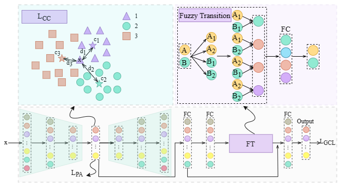

# Deep Imbalance Learning via Fuzzy Theory and Multi-prototypical Learning (FTMS, Neural Networks 2023)

This repository contains the Pytorch implementations of the following Neural Networks 2023 paper:

Yaxin Hou, Chongsheng Zhang. Deep Imbalance Learning via Fuzzy Theory and Multi-prototypical Learning. Neural Networks 2023. &nbsp; &nbsp;[Paper]()

## Introduction
 
This work (FTMS) aims to 



Abstract: 

## Prerequisites

All codes are written by Python 3.8 with:

* Operating System: Windows 10
* torch              1.13.0
* torchaudio         0.13.0
* torchvision        0.14.0
* pandas             1.5.2
* scikit-learn       1.1.3
* imbalanced-learn   0.9.1
* numpy              1.23.5
* openpyxl           3.0.10

## Code structure description

```
   QAST
   ├──data
   │   ├──original_data  
   │   └──spilted_data
   │
   ├──model
   │   ├──model.png
   │   └──model.py
   │
   ├──result
   │
   ├──trained_model
   │   
   ├──utils
   │   ├──log.py
   │   ├──dataset.py
   │   ├──split_data.py
   │   └──transformer.py 
   │
   ├──FTMS_TRAIN.py
   ├──FTMS_TEST.py
   └──README.MD
```   
  
## Train
  
  To train a classifier for class-imbalanced data:

   ```
   python FTMS_TRAIN.py --dataset mfcc
   ```
  
## Test
 
  To test the classifier with the trained model(mfcc)

  ```
   python FTMS_TEST.py --dataset mfcc
   ```

## Our Trained models
Under the folder “trained_model”, we have uploaded our trained models for the CWRU Bearing Dataset.

*  Classification model is at `./trained_model/`

## Citation

If you find our method useful, please consider citing our paper:

  ```
  @inproceedings{qastaaai2023,
    title={Deep Imbalance Learning via Fuzzy Theory and Multi-prototypical Learning},
    author={Yaxin Hou and Chongsheng Zhang},
    booktitle={Neural Networks},
    year={2023},
  }
  ```